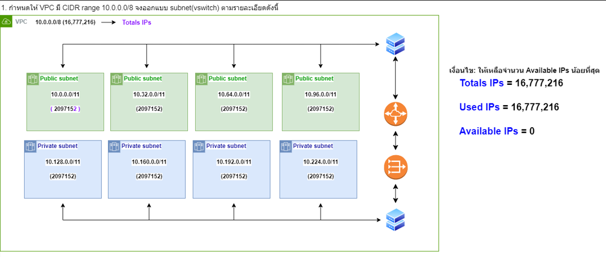
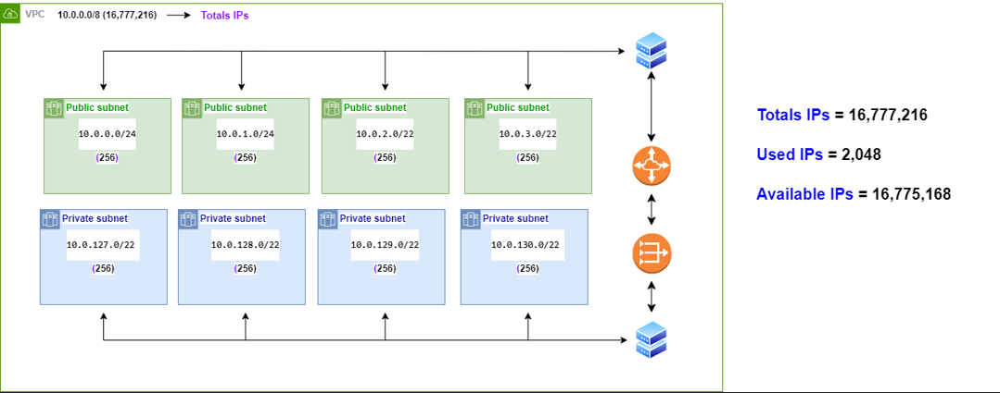

# 1.กำหนดให้ VPC มี CIDR range 10.0.0.0/8 จงออกแบบ subnet(vswitch) ตามรายละเอียดดังนี้
  
##   1.1 public 4 zone พร้อมระบุจำนวน ip ที่ใช้ได้
###    - ได้ Zone ละ 2,097,152 IP || รวม 4 zone = 2,097,152*4 = 8,388,608 IP
##    1.2 private: 4 zone พร้อมระบุจำนวน ip ที่ใช้ได้
###    - ได้ Zone ละ 2,097,152 IP || รวม 4 zone = 2,097,152*4 = 8,388,608 IP 
##    1.3 ระบุจำนวน ip ที่ยังเหลือ
###    - เหลือ 16,777,216 - 16,777,216 = 0 IP

##   * เงื่อนไข: ให้เหลือจำนวน Available IPs น้อยที่สุด

# 2.กำหนดให้ VPC มี CIDR range 10.0.0.0/8 จงออกแบบ subnet(vswitch) ตามรายละเอียดดังนี้
  
##    2.1 public 4 zone พร้อมระบุจำนวน ip ที่ใช้ได้
###    - ได้ Zone ละ 256 IP || รวม 4 zone = 256 * 4 = 1024 IP
##    2.2 private: 4 zone พร้อมระบุจำนวน ip ที่ใช้ได้
###    - ได้ Zone ละ 256 IP || รวม 4 zone = 256 * 4 = 1024 IP
##    2.3 ระบุจำนวน ip ที่ยังเหลือ
###   - เหลือ 16,777,216 - 2048 = 16,775,168 IP

##    * เงื่อนไข: ให้เหลือจำนวน Available IPs มากที่สุดcd