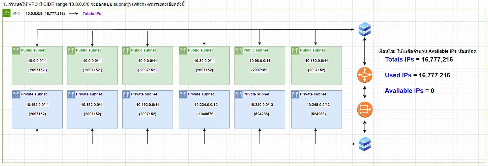
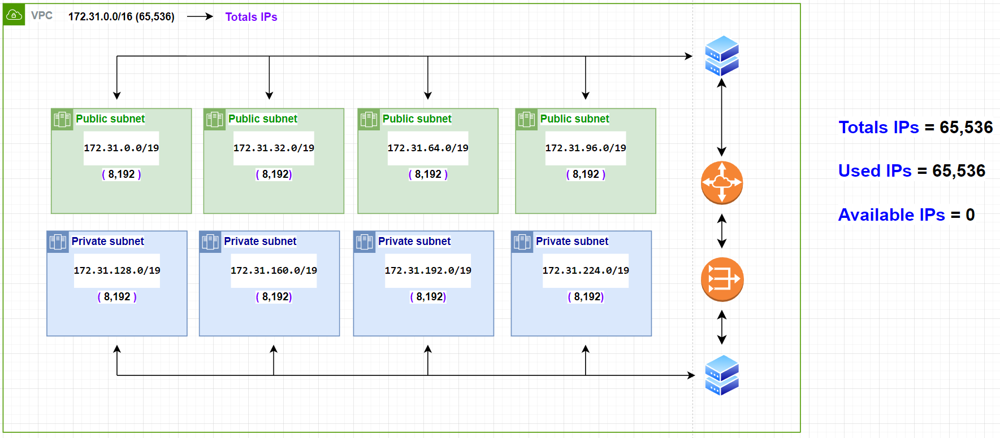
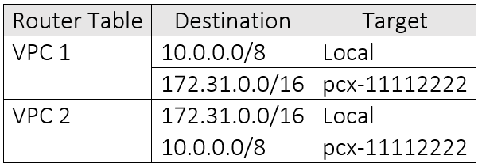
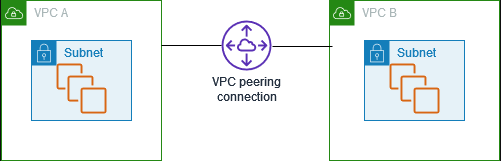
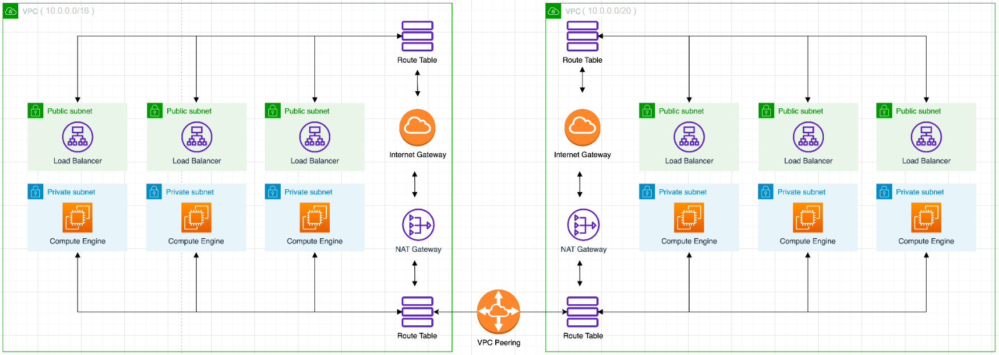
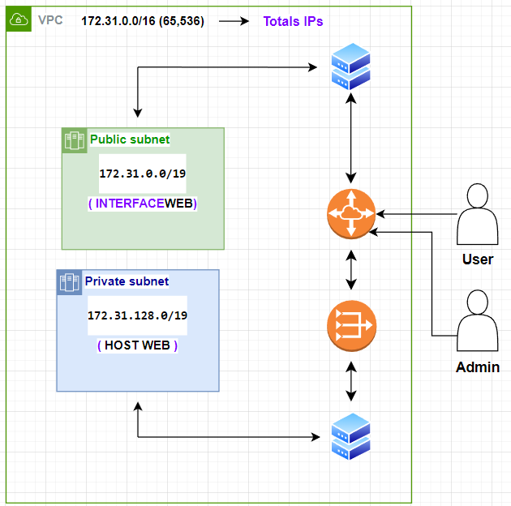

# 1.  กำหนดให้ VPC มี CIDR range 10.0.0.0/8 (16,777,216) จงออกแบบ subnet(vswitch) ตามรายละเอียดดังนี้
  
###   1.1 public 6 zone พร้อมระบุจำนวน ip ที่ใช้ได้
####    - ใช้ /12 ทั้งหมด 4 Zone Zone ละ 1,048,576 IP || รวม 4 zone = 1,048,576 * 4 = 4,194,304 IP
####    - ใช้ /11 ทั้งหมด 2 Zone Zone ละ 2,097,152 IP || รวม 2 zone = 2,097,152 * 2 = 4,194,304 IP
####    - ทั้งหมด 6 Zone รวม /12 4 Zone + /11 2 Zone = 4,194,304 + 4,194,304 = 8,388,608 IP
###    1.2 private: 6 zone พร้อมระบุจำนวน ip ที่ใช้ได้
####    - ใช้ /12 ทั้งหมด 4 Zone Zone ละ 1,048,576 IP || รวม 4 zone = 1,048,576 * 4 = 4,194,304 IP
####    - ใช้ /11 ทั้งหมด 2 Zone Zone ละ 2,097,152 IP || รวม 2 zone = 2,097,152 * 2 = 4,194,304 IP
####    - ทั้งหมด 6 Zone รวม /12 4 Zone + /11 2 Zone = 4,194,304 + 4,194,304 = 8,388,608 IP
###    1.3 ระบุจำนวน ip ที่ยังเหลือ
####    - เหลือ 16,777,216 - (8,388,608 * 2) = 0 IP

##   * เงื่อนไข: ให้เหลือจำนวน Available IPs น้อยที่สุด

# 2.  กำหนดให้ VPC มี CIDR range 172.31.0.0/16 (65,536) จงออกแบบ subnet(vswitch) ตามรายละเอียดดังนี้
  
###    2.1 public 4 zone พร้อมระบุจำนวน ip ที่ใช้ได้
####    - ใช้ /19 ทั้งหมด 4 Zone Zone ละ 8,192 IP || รวม 4 zone = 8,192 * 4 = 32,768 IP
###    2.2 private: 4 zone พร้อมระบุจำนวน ip ที่ใช้ได้
####    - ใช้ /19 ทั้งหมด 4 Zone Zone ละ 8,192 IP || รวม 4 zone = 8,192 * 4 = 32,768 IP
###    2.3 ระบุจำนวน ip ที่ยังเหลือ
####   - เหลือ 65,536 - (32,768 * 2) = 0 IP

##    * เงื่อนไข: ให้เหลือจำนวน Available IPs น้อยที่สุด

# 3.  จากคำตอบข้อ 1 และ 2 ให้ตอบคำถามย่อยต่อไปนี้
###    3.1 ต้องใช้ Service อะไรที่ทำให้ VPC จากข้อที่ 1 และ 2 สามารถรับส่งข้อมูลถึงกันได้
####    - VPC peering connection เป็น การเชื่อมต่อในรูปเเบบ network ระหว่าง 2 VPCs 
###    3.2 จงวาดตาราง Route Table พร้อมระบุการ ค่าให้เรียบร้อย
  

# 4.  (optional) ให้ออกแบบระบบซื้อขายของออนไลน์โดยมีองค์ประกอบดังนี้
###    4.1 สินค้า (product), ตะกร้าสินค้า(cart), จ่ายเงิน(payment), การขนส่งสิ่นค้า(Shipping), ผู้ใช้ (user)
####    - 
###    4.2 Database Service
####    - 
###    4.3 สามารถรองรับผู้ใช้งานได้จำนวนมหาศาล (แบบง่าย)
####    - 

# 5.  กำหนดให้ VPC A มี CIDR (10.0.0.0/16) และ VPC B  มี CIDR (10.0.0.0/20)จงตอบคำถามต่อไปนี้
###    5.1 VPC A และ VPC B สามารถ peering กันได้หรือไม่ หากไม่ได้จงบอกเหตุผล
####    - ไม่ได้ เนื่องจาก เลข Network ทับกันทำให้ตัว peering ไม่รู้ว่าควรจะไปทางไหน เพราะงั้นจึงทำไม่ได้
###    5.2 กรณีถ้า Peering ได้ จะต้องทำอย่างไร ให้ service ที่อยู่ภายใน VPC ทั้งสองสามารถติดต่อสื่อสารกันได้
####    - ทำการต่อ อุปกรณ์ VPC peering connection เข้าไประหว่าง VPC ทั้งสองตัว เเละสร้าง Route Table
###    5.3 ให้วาดรูป architecture ประกอบ
  
###    5.4 (Optional) ใส่ component อื่นๆ ให้ครบ เช่น LB, Compute Engine, NatGW
  

##    * หมายเหตุ: วาดมือ / draw.io

# 6.  Hypervisor มีกี่ประเภทแต่ละประเภทคืออะไรบ้าง แล้วประเภทไหนที่ Computer ของเราใช้งานในการเปิด emulator (อยากให้ตอบตามความเข้าใจ ห้าม copy มาตอบ)
###   - มี 2 ประเภท Hypervisor Type I จะทำงานโดยตรงบน Hardware กับ Hypervisor Type II จะทำหน้าที่เป็น Software ประเภทที่เปิด emulator คือ Hypervisor Type II

# 7.  (optional) ให้ออกแบบ architecture ที่นำ application ของเรามาเชื่อมต่อกับ Cloud (ไม่มีผิดไม่มีถูกอยากให้ลองออกแบบกันมาว่าถ้า application ของเราขึ้นไปอยู่บน cloud จะมีหน้าตาแบบไหน)
  

# 8.  ให้ตอบคำถามต่อไปนี้เกี่ยวกับ Debian
###    8.1 Debian คืออะไร 
####    - Debian OS(เดเบี้ยนโอเอส) เป็นชุดของซอฟต์แวร์เสรีที่พัฒนาโดยอาสาสมัครภายใต้โครงการเดเบียน ภายใต้โครงการนี้มีเดเบียนลินุกซ์ (Debian GNU/Linux) (เดเบี้ยล จีเอ็นยู รีนุก) ที่ใช้ลินุกซ์เป็นเคอร์เนล และใช้เครื่องมือต่าง ๆ ในโครงการ GNU(จีเอ็นยู) ประกอบกันเป็น OS(ระบบปฎิบัติการ)
###    8.2 version stable ล่าสุดมีชื่อเล่นว่าอะไร
####    - Debian 11 ("bullseye")
###    8.3 Package Manager ต้องใช้คำสั่งอะไร
####    - dpkg --คำสั่ง.
###    8.4 หากต้องการติดตั้ง git ควรใช้คำสั่งอะไร
####    - sudo apt update|sudo apt install git

# 9.  ให้ตอบคำถามต่อไปนี้เกี่ยวกับ Alpine
###    9.1 Alpine คืออะไร 
####    - Alpine Linux คือ ระบบปฏิบัติการที่พัฒนาโดยชุมชนซึ่งออกแบบมาสำหรับเราเตอร์ x86 ไฟร์วอลล์เครือข่ายส่วนตัวเสมือนโทรศัพท์ IP และเซิร์ฟเวอร์
###    9.2 version stable ล่าสุดมีชื่อเล่นว่าอะไร
####    - 3.17.2
###    9.3 Package Manager ต้องใช้คำสั่งอะไร
####    - apk คำสั่ง
###    9.4 หากต้องการติดตั้ง git ควรใช้คำสั่งอะไร
####    - apk update|apk upgrade|reboot|apk add git

# 10.  ให้ตอบคำถามต่อไปนี้เกี่ยวกับ Amazonlinux
###    10.1 Amazonlinux คืออะไร 
####    - Amazon Linux 2 เป็นระบบปฏิบัติการ Linux จาก Amazon Web Services (AWS) ซึ่งมีสภาพแวดล้อมการทำงานที่เน้นด้านการรักษาปลอดภัย เสถียร และมีประสิทธิภาพสูงเพื่อพัฒนาและรันแอปพลิเคชันบนระบบคลาวด์ Amazon Linux 2 ให้บริการโดยไม่คิดค่าบริการเพิ่มเติม AWS มีการอัปเดตระบบรักษาความปลอดภัยและการบำรุงรักษาสำหรับ Amazon Linux 2 อย่างต่อเนื่อง
###    10.2 version stable ล่าสุดมีชื่อเล่นว่าอะไร
####    - Amazon Linux AMI 2018.03
###    10.3 Package Manager ต้องใช้คำสั่งอะไร
####    - sudo yum คำสั่ง
###    10.4 หากต้องการติดตั้ง git ควรใช้คำสั่งอะไร
####    - sudo yum update -y|sudo yum install git -y

# 11.  หากเราต้องการสร้างบริษัทเป็นผู้ให้บริการ Cloud จงตอบคำถามต่อไปนี้
###    11.1 เราควรมีอุปกรณ์ Hardware อะไรบ้าง พร้อมอธิบาย 
####    - คอมพิวเตอร์ Main เพื่อไว้ควบคุม เวอร์ชั่นเเละข้อมูลบางส่วน
####    - Storage เป็น Harddisk หรือ SSD ก็ได้จำนวนมาก เพื่อลองรับข้อมูลของผู้ใช้
####    - Router เพื่อทำ Routing table ในการส่งผู้ใช้ไปยังข้อมูลต่างๆ
####    - Nat เพื่อป้องกันไม่ให้ผู้ใช้ภายนอกเข้าถึงข้อมูลหรือส่วนที่เฉพาะเจ้าหน้าที่ได้
###    11.2 เราควรมี Software อะไรบ้าง พร้อมอธิบาย
####    - คือบอกรักษาความปลอดภัย Docker
###    11.3 วาดภาพ Architecture ของ Cloud Service ของเรา
  
###    11.4 ชื่อ Cloud ที่เราให้บริการมีชื่อว่าอะไร
####    - Golf cloud
###    11.5 Cloud ของเรามี service อะไร ที่ให้บริการผู้ใช้งานได้บ้าง
####    - SaaS
####      เป็นบริการสำหรับ User
####      เน้นใช้งาน พูดง่ายๆ ก็ซอฟต์แวร์ทุกชนิดที่ออนไลน์อยู่บนคลาวด์
####      เช่น Office365, Google Doc, Webex