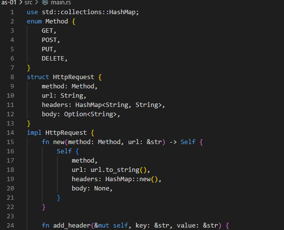
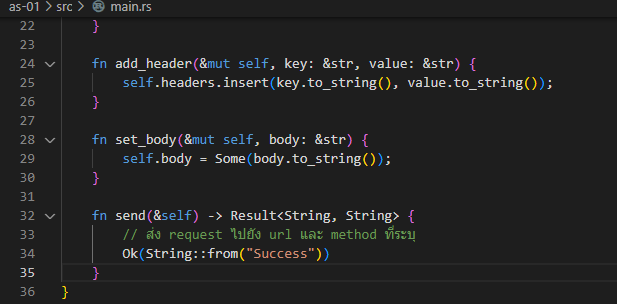
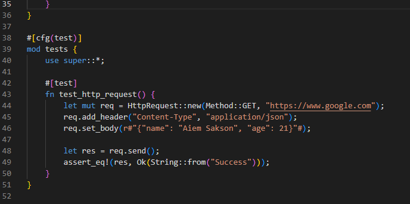
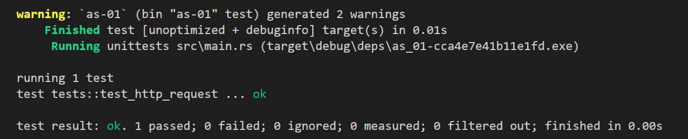

# **LAB 7 Assignment 1**
## ศักย์ศรณ์ อัจจมาธร เลขที่ 22
### 1.ให้ Design httpRequest พร้อมเขียน code และรันแสดงผลลัพธ์
#### HttpRequest ประกอบไปด้วย property ต่างๆ ดังนี้:
     method: enum Method ที่เก็บ method ของ request เช่น GET, POST, PUT, DELETE
     url: สตริงที่เก็บ URL ของ request
     headers: HashMap ที่เก็บ headers ของ request เช่น Content-Type, Authorization
     body: สตริงที่เก็บ body ของ request
#### โดยมี method ต่างๆ ดังนี้:
     new: สร้าง HttpRequest ใหม่โดยกำหนด method และ url
     add_header: เพิ่ม header ใหม่ลงใน headers
     set_body: กำหนดค่า body ของ HttpRequest
     send: ส่ง HttpRequest ไปยัง URL ที่ระบุ และ return ผลลัพธ์

#### ในส่วนของ test ก็เรียกใช้ method ต่างๆของ HttpRequest และตรวจสอบผลลัพธ์ว่าถูกต้องหรือไม่
