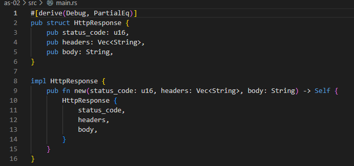

# **LAB 7 Assignment 2**
## ศักย์ศรณ์ อัจจิมาธร เลขที่ 22
### 2.ให้ Design httpResponse พร้อมเขียน code และรันแสดงผลลัพธ์
#### HttpResponse ซึ่งประกอบด้วยส่วนประกอบต่าง ๆ ดังนี้
     status_code: รหัสสถานะของ response เช่น 200, 404, 500 
     headers: headers ของ response เช่น Content-Type, Content-Length 
     body: body ของ response

#### Test it!
